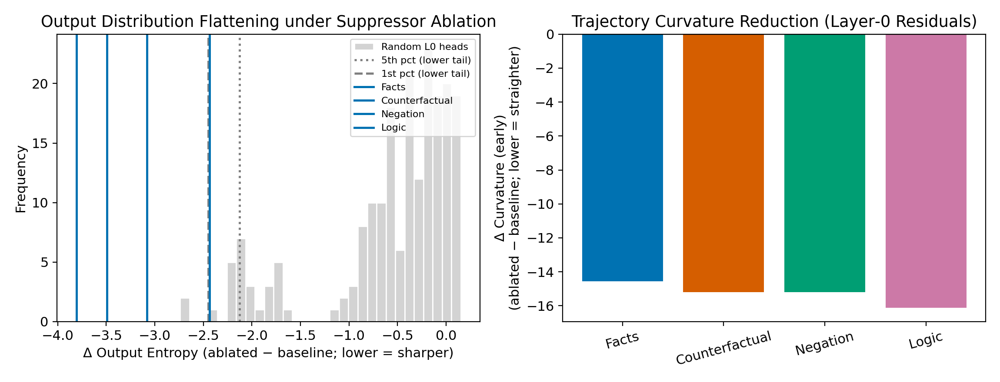

# Tiny Ablation Lab

A reproducible, local‑first workspace for mechanistic interpretability on Apple Silicon. This repository accompanies the October 2025 study **“Layer‑0 Suppressors Ground Hallucination Inevitability”**, and ships end‑to‑end code to replicate the findings on GPT‑2 Medium and Mistral‑7B. It now includes the geometric validation of suppressors via output entropy and trajectory curvature.

Paper PDF: `paper/main.pdf`

Key idea: circuits that implement the factuality vs hedging tradeoff crystallize at the first bottleneck (layer 0). We validate this prediction with dual observables (power: ΔLD; information: calibration), random head baselines, cross‑architecture checks, path mediation, and now geometric signatures.

## Highlights

- Strong geometric signature under suppressor ablation across all probe families (facts, counterfactual, negation, logic):
  - Output entropy reduction: ΔH = −2.4 to −3.8 nats (lower is sharper), all in the extreme lower tail of random layer‑0 head controls (p < 0.02).
  - Early trajectory straightening in layer‑0 residuals: Δ curvature (early) ≈ −14 to −16.
- Activation space expands under suppressors (negative Δ activation entropy under ablation across estimators), consistent with a rotation‑plus‑expansion mechanism coupled with output flattening.
- Location is forced by geometry: the operation appears at layer 0; implementation varies by model.
- Fully reproducible harness and figure scripts; all key reports are committed.

### Geometric Signature Figure



Left: distribution of output‑entropy deltas from random layer‑0 head sets (gray). Vertical lines show observed deltas for the four tasks under ablation of heads (0:2, 0:4, 0:7) in GPT‑2 Medium. Right: early curvature deltas (all negative), consistent with removal of an early hedging attractor.

## Table of Contents

1. [Quick Start](#quick-start)
2. [Repository Layout](#repository-layout)
3. [Reproducing the Study](#reproducing-the-study)
4. [Available Artefacts](#available-artefacts)
5. [Documentation](#documentation)
6. [Contributing](#contributing)
7. [Citation](#citation)

## Quick Start

```bash
git clone https://github.com/Mat-Tom-Son/tinyLab.git
cd tinyLab
bash scripts/setup_env.sh
source .venv/bin/activate
python smoke_test.py  # optional sanity check
```

- `setup_env.sh` installs all pinned dependencies (see `pyproject.toml`) and validates PyTorch MPS.
- `smoke_test.py` loads GPT‑2‑small and checks the harness wiring; skip it if you know your environment is ready.
- For an annotated walkthrough of the harness, see [QUICKSTART.md](QUICKSTART.md).

## Repository Layout

| Path | Purpose |
| --- | --- |
| `lab/` | Experiment harness, batteries, configs, and recorded runs |
| `lab/runs/` | Hash-stamped outputs referenced in the paper (configs, metrics, artefacts) |
| `reports/` | Aggregated analysis dumps (OV projections, partial patch summaries) |
| `paper/` | LaTeX source, figure scripts, and the compiled PDF |
| `docs/` | Project notes (`suppressor_handover.md`, reproduction checklist, etc.) |

## Reproducing the Study

A full, step‑by‑step guide covering dataset preparation, GPT‑2 and Mistral runs, analysis scripts, and paper compilation is in `docs/REPLICATION.md`. The high‑level flow is:

1. Corpora — use the provided single‑token probe datasets under `lab/data/corpora/`. If you need fresh tokenizer variants, run `scripts/build_tokenizer_variants.py`.
2. GPT‑2 experiments — orchestrated configs under `lab/configs/run_h1_cross_condition_balanced.json`, `run_h5_layer0_triplet_balanced.json`, and `run_h6_layer_targets_window_balanced.json` reproduce the H1/H5/H6 batteries.
3. Mistral experiments — `lab/configs/run_h1_cross_condition_balanced_mistral*.json` cover per‑condition sweeps; pair and triplet follow‑ups live alongside (`run_h5_*mistral*.json`).
4. Analysis scripts — regenerate figures and tables via the Python utilities in `paper/scripts/`.
5. Paper build — `cd paper && make` uses `latexmk` to compile `paper/main.pdf` from source.

All runs log reproducibility metadata (`config.json`, hashes, seeds, git commit) into their respective `lab/runs/<run_id>/` directories.

For a quick orientation of directories, see `docs/STRUCTURE.md`.

### Multi‑token Evaluation

Set `"metric_span": "full_target"` in any config to enable span-aware metrics that score the entire target vs foil continuation under teacher forcing. New metrics are added alongside existing first‑token metrics and flow into the standard tables:

- `seq_logprob_diff` — mean over examples of log p(target seq) − log p(foil seq) under the ablated model.
- `seq_p_drop` — mean drop in log p(target seq) from clean to ablated.
- `seq_kl_mean` — mean KL(p_clean || p_ablated) across continuation positions (target path).

This works with current single‑token corpora and generalizes automatically to multi‑token corpora when provided.

### Regenerate Standardized Reports

After running H1/H5/H6, regenerate all standardized exports (summaries, rankings, OV token tables, H5/H6 consolidated CSVs, manifest) with:

```
make postprocess
```

Key outputs land in `reports/` and are indexed by `reports/RESULTS_MANIFEST.json`.

## Reproduce the Geometric Signature

Run the activation‑entropy and curvature analysis for a given task (examples use GPT‑2 Medium, heads 0:2, 0:4, 0:7; 64 samples and 50 random controls):

```bash
source .venv/bin/activate
python -m lab.analysis.activation_entropy \
  --config lab/configs/run_h1_cross_condition_balanced.json \
  --tag facts \
  --device mps \
  --samples 64 \
  --heads 2 4 7 \
  --random-samples 50 \
  --entropy-methods subspace,diagonal,per_token \
  --output reports/activation_entropy_gpt2medium_facts_robust.json

# Repeat with --tag cf, neg, logic
```

Generate the figure shown above:

```bash
python paper/scripts/geometric_signature.py
# writes paper/figures/geometric_signature.{pdf,png}
```

Observed deltas for GPT‑2 Medium:
- Facts: ΔH_out = −2.44 (p < 0.02), Δ curvature (early) ≈ −14.6
- Counterfactual: ΔH_out = −3.49 (p < 0.02), Δ curvature (early) ≈ −15.2
- Negation: ΔH_out = −3.81 (p < 0.02), Δ curvature (early) ≈ −15.2
- Logic: ΔH_out = −3.08 (p < 0.02), Δ curvature (early) ≈ −16.1

---

## Release and Submission

This repository is tagged with a release for the paper (e.g., `v1.0-suppressor-paper`). To access the exact version used for submission:

```
git checkout v1.0-suppressor-paper
pip install -e .
python3 scripts/verify_manifest.py  # Verify integrity
```

### For Reviewers

Download a bundle of key artifacts:

```
make bundle_review
# Creates: build/results_bundle_YYYYMMDD.tar.gz (+ .sha256)
```

Verify and extract:

```
sha256sum -c build/results_bundle_*.tar.gz.sha256 || shasum -a 256 -c build/results_bundle_*.tar.gz.sha256
tar -xzf build/results_bundle_*.tar.gz
```

The bundle includes the manifest, head rankings, OV reports, and docs for independent verification.

## Available Artefacts

- GPT‑2 head sweeps — `lab/runs/h1_cross_condition_physics_balanced_*`
- Mistral head sweeps — `lab/runs/h1_cross_condition_balanced_mistral_*`
- Pair and triplet ablations — `lab/runs/h5_layer0_*`
- Reverse patching — `lab/runs/h6_layer_targets_window_balanced_*`
- OV projections and partial patches — `reports/ov_report_*.json`, `reports/facts_partial_summary.json`
- Geometric signature reports — `reports/activation_entropy_gpt2medium_*_robust.json`
- Geometric signature figure — `paper/figures/geometric_signature.pdf` and `.png`

Feel free to inspect these directly or rerun analyses using the scripts referenced in `Results.md`.

## Development and Quality Checks

- Install dev dependencies: `pip install -e .[dev]`
- Enable git hooks: `pre-commit install`
- Run format/lint locally: `pre-commit run --all-files`
- Ensure reports manifest is consistent: `python scripts/verify_manifest.py`
- GitHub Actions runs the same checks plus `smoke_test.py` on every PR.

- `docs/suppressor_handover.md` — narrative overview, status, and next steps.
- `docs/REPLICATION.md` — definitive reproduction checklist with expected outputs.
- `Results.md` — mapping from each figure and table to the generating script and its inputs.

## Contributing

Bug reports, replication notes, and PRs are welcome. The harness targets macOS on Apple Silicon with PyTorch MPS; CPU/LINUX support is unoptimised but functional. Before opening a PR, please:

1. Run `python smoke_test.py`.
2. Regenerate any touched figures via the scripts in `paper/scripts/`.
3. Ensure `cd paper && make` completes without errors.

## Citation

```bibtex
@misc{tinyablation2025suppressors,
  title        = {Layer-0 Suppressors Ground Hallucination Inevitability},
  author       = {Mat Thompson},
  year         = {2025},
  howpublished = {Tiny Ablation Lab, GitHub repository},
  note         = {\url{https://github.com/Mat-Tom-Son/tinyLab}}
}
```

For changelog details predating the suppressor work, see [CHANGELOG_v1.1.md](CHANGELOG_v1.1.md).
